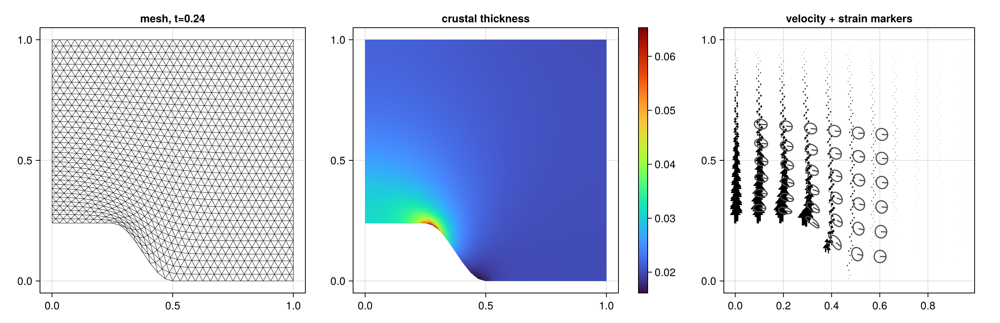

# Basil.jl

A thin Julia wrapper around [basil_jll](https://github.com/JuliaBinaryWrappers/basil_jll.jl),
the precompiled binary distribution of [basil](https://github.com/greg-houseman/basil) —
the 2-D finite-element viscous-flow code by G.A. Houseman, T.D. Barr and L.A. Evans
(plane-strain, thin viscous sheet, thin viscous shell and axisymmetric deformation
of a viscous medium, with crustal-thickness evolution, faults and strain markers).

basil_jll ships the solver as **executables** (no shared library), so this package:

1. helps you **build basil input files** from Julia,
2. **runs the solver** as a subprocess (no compiler, no `make` — the binary is
   downloaded automatically for Linux, macOS and FreeBSD), and
3. **reads the binary solution files** (`FD.sols/*`, Fortran unformatted records)
   back into Julia and **plots** them via a [Makie](https://docs.makie.org)
   extension.


*Model `INn3A0` from the upstream basil `examples/indenter` suite — the basic
Cartesian indenter of Houseman & England (1986) with power-law exponent n = 3
(`SE=3.0`) and Argand number Ar = 0 (`ARGAN=0.0`, no buoyancy) — at t = 0.24:
deformed finite-element mesh, crustal thickness, and velocity field with
strain-marker ellipses. Produced by `examples/indenter.jl` from the bundled
copy of this input (`example_input(:indenter)`).*

> **Platforms**: basil_jll has no Windows build — use WSL on Windows.
> All basil quantities are dimensionless; see `man basil` in the upstream repo.

## Installation

Until the package is registered:

```julia
julia> ]
pkg> add https://github.com/wenrongcao/Basil.jl
```

## Quick start: run an existing basil input file

`run_basil` works on any classic basil input file you already have. Here we
use the bundled `INn3A0` indenter template (`example_input(:indenter)`) —
substitute the path to your own input file.

```julia
using Basil

# 1. put the input file in a working directory
workdir = mktempdir()               # or an existing model directory
inputfile = joinpath(workdir, "indenter.in")
cp(example_input(:indenter), inputfile)

# 2. run the solver (creates FD.sols/ and FD.out/ inside workdir)
result = run_basil(inputfile)

# 3. read all saved timesteps from the binary solution file
recs = read_solution(result.solution)
rec  = recs[end]                    # final state
solution_time(rec)          # dimensionless model time
x, y   = coordinates(rec)   # nodal positions (deformed mesh)
ux, uy = velocity(rec)      # nodal velocities
th     = thickness(rec)     # crustal thickness (exp of stored log-thickness)
mx, my = markers(rec)       # strain-marker ellipses

# 4. plot (loading any Makie backend activates the extension)
using CairoMakie
plotmesh(rec)                                   # FE mesh (deformed)
plotfield(rec, thickness(rec); title="crustal thickness, t=$(solution_time(rec))")
plotvelocity(rec; decimate=4)                   # velocity arrows
```

Already have solution files from earlier basil runs? `read_solution` works on
any `FD.sols/<name>` file directly — no need to rerun the model. The classic
PostScript plotter is also wrapped: `run_sybilps("figure.log")` (the
interactive X11 `sybil` GUI is not part of basil_jll).

## Building input files from Julia (optional)

Input files can also be composed programmatically — `command!` serializes any
basil keyword command, `raw!` adds free-form lines (boundary conditions,
regions):

```julia
inp = BasilInput("my model")
command!(inp, "MESH";     TYPE=0, NX=32, AREA=0.05, QUALITY=15)
command!(inp, "GEOMETRY"; XZERO=0.0, XLEN=1.0, YZERO=0.0, YLEN=1.0, NCOMP=0)
command!(inp, "VISDENS";  SE=3.0)
command!(inp, "SOLVE";    AC=5.0e-7, ACNL=5.0e-6, ITSTOP=1000)
command!(inp, "STEPSIZE"; TYPE="RK", IDT0=40, MPDEF=10)
command!(inp, "STOP";     KEXIT=100, TEXIT=0.24)
raw!(inp,
     "ON X = 0.0 : UX = 0.0",
     "ON Y = 0.0 FOR X = 0.0 TO 0.25 : UY = 1.0")
write_input(joinpath(workdir, "mymodel"), inp)
```

See the bundled template (`example_input(:indenter)`) and `man basil` in the
upstream repo for the full command vocabulary.

## API

| function | purpose |
|---|---|
| `BasilInput`, `command!`, `raw!`, `write_input`, `example_input` | build input files |
| `run_basil(input; workdir, name, verbose, force)` | run the solver |
| `run_sybilps(log; output)`, `basil_version()` | auxiliary executables |
| `read_solution(path)`, `read_record(path, i)` | read `FD.sols` binaries |
| `coordinates`, `triangles`, `velocity`, `pressure`, `thickness`, `rotation`, `viscosity`, `density`, `markers`, `solution_time` | field accessors on a `BasilRecord` |
| `ivar(rec, :NUP)`, `rvar(rec, :TIME)` | named access to basil's 64 integer / 64 real header scalars |
| `plotmesh`, `plotfield`, `plotvelocity` (+ `!` variants) | Makie extension |

`BasilRecord` also exposes the raw arrays (`lem`, `nor`, `uvp`, `qbnd`,
`vhb`, …) exactly as basil stores them; note coordinates are stored in a
different node order than the solution vector (`ex[nor[j]]` pairs with
`uvp[j]`) — the accessors handle this for you.

## Development / publishing checklist

See [PLAN.md](PLAN.md) for the full design document, registration steps and
known pitfalls (record-format coupling to basil v1.8.2, Windows absence,
GPL-3.0 licensing, etc.).

## License

GPL-3.0, same as basil itself (the bundled example input derives from the
basil repository).
